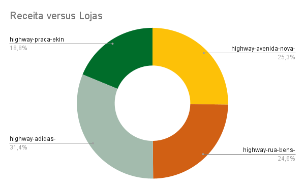
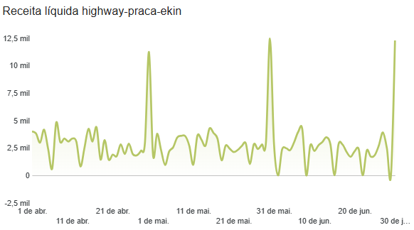
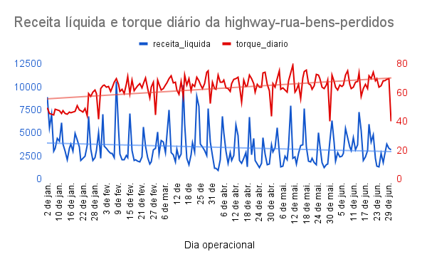

# Relatório da Análise de desempenho - Highway

Este relatório contém uma descrição da análise de desempenho das lojas Highway e a construção de um índice de Saúde Financeira.

## Visão geral do problema

**O setor de varejo é fundamental para a economia brasileira**, representando aproximadamente 22% do PIB. No entanto, a longevidade das empresas no país é um desafio: 17% das pequenas e médias fecham as portas em até cinco anos.

As causas desse fechamento são complexas, dividindo-se entre **fatores internos**, como a gestão financeira, e **externos**, como crises econômicas ou sanitárias. Diante desse cenário, o **monitoramento constante das variáveis de faturamento** é uma estratégia crucial para a sobrevivência e o crescimento de qualquer negócio.

As lojas da franquia **Highway de Lorenzzo** possuem um faturamento anual de R$ 4,4 milhões. No entanto, a contribuição individual de cada loja para a receita total não é clara.

Para auxiliar no monitoramento do desempenho de cada unidade, este estudo foi desenvolvido com o objetivo de responder, a partir dos dados fornecidos, às seguintes perguntas de negócio:

- Qual a receita gerada por cada uma das lojas?
- Qual o torque das lojas e a sua evolução temporal?

## Fonte e preparação dos dados

Para a construção do *dashboard* foram usadas as tabelas `receipts` , `torque` e `discounts` , buscando obter informações sobre receita, torque, número de descontos, número de vendas e canal de vendas. Para a análise deste relatório a tabela `discounts` não será necessária. 

## Índice de Saúde Financeira

A construção do índice foi feita usando como base o torque diário, calculado por

$Torque = faturamento/nº \,\,de\,\, pães\,\, vendidos$

A métrica chamada de **Torque** representa o valor agregado por cada pão vendido. Como a venda de sanduíches é a base do negócio, essa medida é fundamental.

O Torque pode ser analisado de forma isolada, mas a sua interpretação se torna mais rica quando se calcula o **Torque médio** ao longo de períodos específicos. Este valor é obtido pela soma dos Torques diários, dividida pelo número de dias analisados.

Essa análise permite avaliar a capacidade de uma loja converter o volume de vendas de pães em receita total. É uma métrica essencial para entender a eficiência da estratégia de precificação e o sucesso das vendas cruzadas**,** como a combinação de sanduíche, bebida e sobremesa.

## Principais insights

Com base no índice desenvolvido, o ranking das lojas no mês de junho, de acordo com o torque médio, é o seguinte:

| **Lojas** | **Torque médio para o mês de junho** |
| --- | --- |
| highway-avenida-nova-balanca | 68,85 |
| highway-rua-bens-perdidos | 65,87 |
| highway-adidas-shopping | 61,06 |
| highway-praca-ekin | 60,25 |

A tabela acima apresenta o ranking das lojas conforme o torque médio. O gráfico abaixo, por sua vez, detalha a participação de cada unidade na receita total.

Embora a loja **highway-avenida-nova-balanca** tenha o maior torque, ela ocupa a segunda posição em contribuição para a receita. Já a **highway-adidas-shopping** se destaca com um grande volume de vendas, gerando quase um terço da receita total das lojas.

Um ponto de atenção é a loja **highway-praca-ekin**, que apresenta o menor torque médio e a menor participação na receita total. É fundamental que se desenvolvam estratégias para melhorar seu desempenho.

Analisando o gráfico de receita da loja entre 01/04/2025 e 30/06/2025, notamos que a partir de junho houve vários dias de fechamento (indicados pela linha indo R$ 0,00). Isso não apenas diminui a receita, mas também afeta negativamente o cálculo do torque médio.

Outro ponto de atenção é a loja **highway-rua-dos-bens-perdidos**. No gráfico que mostra a evolução da receita e do torque diário em 2025, nota-se um aumento expressivo no torque a partir de fevereiro. No entanto, a receita não acompanhou essa tendência, apresentando, na verdade, uma leve queda geral. A linha em azul no gráfico destaca essa diminuição.

## Recomendações

Para julho, é crucial **revisar e evitar os fechamentos** ocorridos em junho na loja **highway-praca-ekin**. Embora a sazonalidade seja um fator, o impacto dos dias fechados na receita é significativo e deve ser minimizado.

Para impulsionar o torque da mesma loja, uma estratégia viável seria a aplicação de **descontos em produtos adicionais**. Por exemplo, uma promoção como "Leve 2 sanduíches e a bebida sai pela metade do preço" incentivaria as vendas cruzadas e aumentaria o valor agregado por pão vendido.

A médio e longo prazo, é essencial investigar a **inversão entre torque e receita na highway-rua-dos-bens-perdidos**. A queda da receita, enquanto o torque aumenta, é um cenário atípico. Uma análise minuciosa das causas é necessária, e a busca por novas estratégias de marketing pode ser uma solução para impulsionar o número de vendas e reverter essa tendência.

## Limitações e próximos passos

Os dados analisados permitiram conclusões importantes, mas a criação de um **Índice de Saúde Financeira** seria mais robusta com informações adicionais.

Para uma análise mais completa, seriam essenciais dados sobre:

- **Custos operacionais e de matéria-prima:** Isso permitiria avaliar não só a receita, mas também o lucro, que é o indicador mais crítico do desempenho de uma empresa.
- **Gestão de estoque:** Informações sobre o estoque e o tempo médio para dar vazão às matérias-primas seriam úteis para entender a eficiência operacional e os custos envolvidos.

Para os próximos passos eu categorizaria os itens de forma a entender quais são frequentemente comprados juntos e se há padrões de compra por loja. Isso permitiria realizar algumas coisas, como:

- **Distribuição de estoque mais eficiente:** Otimizar o estoque de cada loja com base em suas tendências de venda específicas.
- **Promoções personalizadas:** Criar descontos exclusivos para cada unidade, direcionados aos hábitos de consumo locais.

Essas ações podem aumentar o volume de vendas e, consequentemente, a receita geral da franquia.
